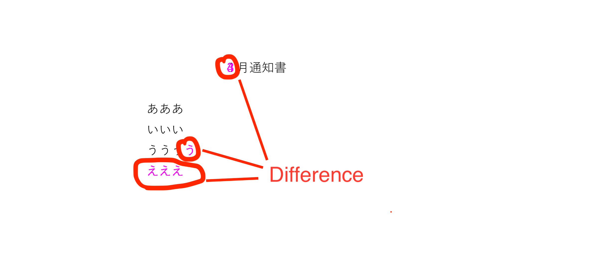
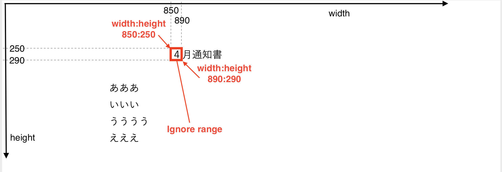

# pdf-diff-commands

Diff display utilities for pdf file.

## Features

Support following features.

* Checking difference for two pdf files after converting to image file
* Can perform bulk comparing for two directories
* Can specify pixel range to be ignored a difference
* Can compare by ignore dynamic part(e.g. date string, random string, sequence string, etc...) on file name on bulk comparing

## How to run

### Using Spring Boot Maven Plugin

```bash
./mvnw spring-boot:run -Dspring-boot.run.arguments=""
```

```
[INFO] Scanning for projects...
[INFO] 
[INFO] -------------------< com.example:pdf-diff-commands >--------------------
[INFO] Building pdf-diff-commands 0.0.1-SNAPSHOT
[INFO] --------------------------------[ jar ]---------------------------------
[INFO] 
[INFO] >>> spring-boot-maven-plugin:2.5.5:run (default-cli) > test-compile @ pdf-diff-commands >>>
[INFO] 
[INFO] --- maven-resources-plugin:3.2.0:resources (default-resources) @ pdf-diff-commands ---
[INFO] Using 'UTF-8' encoding to copy filtered resources.
[INFO] Using 'UTF-8' encoding to copy filtered properties files.
[INFO] Copying 1 resource
[INFO] Copying 0 resource
[INFO] 
[INFO] --- maven-compiler-plugin:3.8.1:compile (default-compile) @ pdf-diff-commands ---
[INFO] Nothing to compile - all classes are up to date
[INFO] 
[INFO] --- maven-resources-plugin:3.2.0:testResources (default-testResources) @ pdf-diff-commands ---
[INFO] Using 'UTF-8' encoding to copy filtered resources.
[INFO] Using 'UTF-8' encoding to copy filtered properties files.
[INFO] Copying 3 resources
[INFO] 
[INFO] --- maven-compiler-plugin:3.8.1:testCompile (default-testCompile) @ pdf-diff-commands ---
[INFO] Nothing to compile - all classes are up to date
[INFO] 
[INFO] <<< spring-boot-maven-plugin:2.5.5:run (default-cli) < test-compile @ pdf-diff-commands <<<
[INFO] 
[INFO] 
[INFO] --- spring-boot-maven-plugin:2.5.5:run (default-cli) @ pdf-diff-commands ---
[INFO] Attaching agents: []

  .   ____          _            __ _ _
 /\\ / ___'_ __ _ _(_)_ __  __ _ \ \ \ \
( ( )\___ | '_ | '_| | '_ \/ _` | \ \ \ \
 \\/  ___)| |_)| | | | | || (_| |  ) ) ) )
  '  |____| .__|_| |_|_| |_\__, | / / / /
 =========|_|==============|___/=/_/_/_/
 :: Spring Boot ::                (v2.5.5)

2021-09-24 11:33:58.484  INFO 12743 --- [           main] c.e.tools.PdfDiffCommandsApplication     : Starting PdfDiffCommandsApplication using Java 11.0.1 on xxx with PID 12743 (/Users/xxx/git-pub/pdf-diff-commands/target/classes started by xxx in /Users/xxx/git-pub/pdf-diff-commands)
2021-09-24 11:33:58.487  INFO 12743 --- [           main] c.e.tools.PdfDiffCommandsApplication     : No active profile set, falling back to default profiles: default
2021-09-24 11:33:58.959  INFO 12743 --- [           main] c.e.tools.PdfDiffCommandsApplication     : Started PdfDiffCommandsApplication in 0.825 seconds (JVM running for 1.206)

[Command arguments]
  --command       : diff-file, diff-dir
  --h (--help)    : print help

[Configuration arguments(Optional)]
  --tools.pdf.image-dpi     : customize an image dpi when converting to image file (default: 300)
                              note that if big value specified, processing time become a too long.
  --tools.pdf.image-type    : customize an image type when converting to image file (default: RGB)
  --tools.pdf.diff-color    : customize a color for emphasizing the difference (default: MAGENTA)
  --tools.pdf.ignore-ranges : specify pixel range to be ignored (default: N/A)
                              if you want to specify multiple range, please separate configuration using ','.
                              value format: {target page}/{start width position(pix)}:{start height position(pix)}/{end width position(pix)}:{end height position(pix)}
                              e.g.) --tools.pdf.ignore-ranges=1/850:250/890:290
                                       ignore range(width:850-890pix height:250-290pix) on first page
                              e.g.) --tools.pdf.ignore-ranges=1/850:250/890:290,1/1050:250/1090:390
                                       ignore ranges(width:850-890pix height:250-290pix, width:1050-1090pix height:250-290pix) on first page

[Usage: diff-file]
  Checking difference for pdf content after converting to image file.
  format: --command=diff-file {files}
  e.g.) --command=diff-file src/test/resources/Book2.pdf src/test/resources/Book3.pdf

[Usage: diff-dir]
  Checking difference for pdf content that stored into a specified directory after converting to image file.
  format: --command=diff-dir (--pattern='{file name extracting regex pattern}') {directories}
  e.g.) --command=diff-dir src/test/resources/pattern1/actual src/test/resources/pattern1/expected
  e.g.) --command=diff-dir --pattern='(Book)(.).*(\.pdf)' src/test/resources/pattern2/actual src/test/resources/pattern2/expected

[INFO] ------------------------------------------------------------------------
[INFO] BUILD SUCCESS
[INFO] ------------------------------------------------------------------------
[INFO] Total time:  2.952 s
[INFO] Finished at: 2021-09-24T11:33:58+09:00
[INFO] ------------------------------------------------------------------------
```

### Using standalone Java Application

```bash
$ ./mvnw clean verify -DskipTests
```

```
$ java -jar target/pdf-diff-commands-0.0.1-SNAPSHOT.jar
```

## Reporting

### Reporting when content is same

This tool report a following information log when two pdf content is same.

```
...
2021-09-24 12:31:20.896  INFO 13075 --- [           main] com.example.tools.DiffFileProcessor      : The pdf content is same. first-file[src/test/resources/Book2.pdf] second-file[src/test/resources/Book3.pdf]
```

### Reporting when content is different

This tool report a following error log when two pdf content is different.

```
...
2021-09-24 12:32:28.639 ERROR 13088 --- [           main] com.example.tools.DiffFileProcessor      : The page content is different. page[1] diff-report-file[target/diff-report/Book1-diff-page-1-1799135128573901411.png] first-file[src/test/resources/Book1.pdf] second-file[src/test/resources/Book3.pdf]
```

Please open diff-report-file using favorite image viewer.
This tool change a pixel color of difference as follows:



## Bulk comparing

This tool support the bulk comparing by specifying two directories.
If you want to use this feature, please use 'diff-dir' command instead of 'diff-file' command.

```
...
└─ pattern2
    ├── actual
    │    └── XxxTest
    │         ├── test001
    │         │    └── Book1.pdf -> Perform comparing
    │         ├── test002
    │         │    └── Book2.pdf -> Perform comparing
    │         └── test003
    │              └── Book3.pdf -> Skip comparing
    └── expected
         └── XxxTest
              ├── test001
              │    └── Book1.pdf -> Perform comparing
              ├── test002
              │    └── Book2.pdf -> Perform comparing
              └── test004
                   └── Book4.pdf -> Skip comparing
```

### Skip comparing

This tool skip comparing pdf content when pdf file does not exist into both directories. If comparing was skipped, it output following warning log.

```
2021-09-24 21:13:02.049  WARN 18246 --- [           main] com.example.tools.DiffDirProcessor       : Skip to compare pdf content because file not exist in second-dir. file[src/test/resources/pattern1/actual/XxxTest/test003/Book3.pdf]
```

or

```
2021-09-24 21:13:02.050  WARN 18246 --- [           main] com.example.tools.DiffDirProcessor       : Skip to compare pdf content because file not exist in first-dir. file[src/test/resources/pattern1/expected/XxxTest/test004/Book4.pdf]
```

## Knowledge

### How to specify ignore range

You can specify pixel range to be ignored using configuration arguments( e.g. `--tools.pdf.ignore-ranges=1/850:250/890:290`).



### How to ignore dynamic part on file name

By default, this tool use the physical file name for searching comparison target file.
But it can be changed using configuration arguments( e.g. `--pattern='(Book)(.).*(\.pdf)'`).
When you specify `--pattern` option, you can search a comparison target file using the logical file name that extracted using regex pattern.

```
...
└─ pattern2
    ├── actual
    │    └── XxxTest
    │         ├── test001
    │         │    └── Book1_20210924134559.pdf -> translate to 'Book1.pdf' as logical file name
    │         └── test002
    │              └── Book2_20210924134659.pdf -> translate to 'Book2.pdf' as logical file name
    └── expected
         └── XxxTest
              ├── test001
              │    └── Book1_20210923134559.pdf -> translate to 'Book1.pdf' as logical file name
              └── test002
                   └── Book2_20210923154559.pdf -> translate to 'Book2.pdf' as logical file name
```
